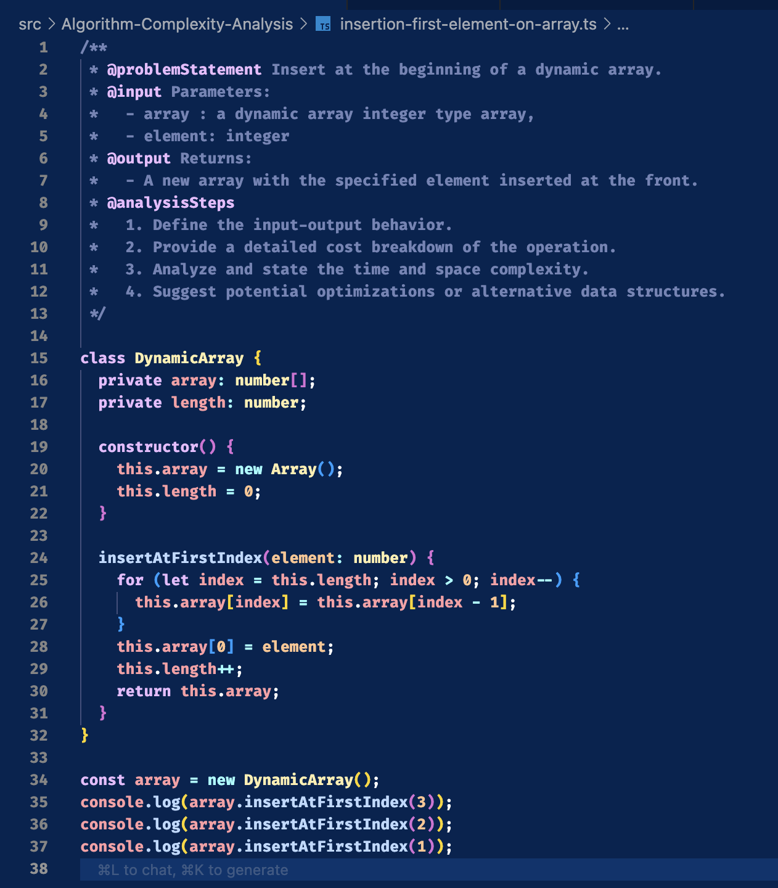

# Part 1: Algorithm Complexity Analysis (30 Points)

Analyze the time and space complexity for each of the following algorithms. For every algorithm:

- Provide input-output mapping.
- Give step-by-step cost breakdown.
- Determine final asymptotic complexities (time and space).
- Suggest optimizations, if any.

## Algorithms:

- Insert at the beginning of a dynamic array.
  
  [Code](../libs/custom-array.ts)

  - **Provide input-output mapping:**
    - **Input:**
      - For functional programming: Provide an array and the element to be added.
      - For class-based programming: Invoke the method and pass the element to be inserted.
  - **Give step-by-step cost breakdown:**
    - To insert at the first index, space must be created by shifting all elements to the right.
    - This requires traversing the array from right to left.
    - The operation takes **O(n)** time.
    - Memory overhead is minimal, with **O(1)** space complexity.
  - **Determine final asymptotic complexities (time and space):**
    - **Time Complexity:** O(n)
    - **Space Complexity:** O(1)
  - **Suggest optimizations, if any:**
    - For faster insertions at the beginning, a **Linked List** can be used.
    - Inserting at the head of a linked list takes **O(1)** time.

- Insert at the end of a linked list.

  ```

  // At last index add new element // Time: O(1) | Space: O(1)
  append(data: string) {
    const newNode = new LinkedNode(data); // Time: O(1) | Space: O(1)

    if (!this.head) {
      // Time: O(1) | Space: O(0)
      this.head = newNode; // Time: O(1) | Space: O(0)
      this.tail = newNode; // Time: O(1) | Space: O(0)
      this.length++; // Time: O(1) | Space: O(0)
      return;
    }

    this.tail!.setNext(newNode); // Time: O(1) | Space: O(0)
    this.tail = newNode; // Time: O(1) | Space: O(0)
    this.length++; // Time: O(1) | Space: O(0)
    return;
  }
  ```

  [Code](../libs/linked-list.ts)

  - **Provide input-output mapping:**
  - **Input:**
    - For functional programming: Provide an linked list and the element to be added.
    - For class-based programming: Invoke the method and pass the element to be inserted.
  - **Give step-by-step cost breakdown:**
    - To insert at the last index, for doubly linked list we can simply add at tail which is 0(1).
    - The operation takes **O(1)** time.
    - Memory overhead is minimal, with **O(1)** space complexity.
  - **Determine final asymptotic complexities (time and space):**
    - **Time Complexity:** O(1)
    - **Space Complexity:** O(1)
  - **Suggest optimizations, if any:**
    - For faster insertions at the end, a **Doubly Linked List** can be used not recommended to use singly linked list.

- Search for an element in a hash set.
- Rehash a hash table after crossing load factor.
- Delete a node from a singly linked list by value.
- Check if an array contains all unique values.
- Count common elements in two hash sets.
- Convert an array into a linked list.
- Clone a hash table with chaining.
- Compare array vs. hash set lookup performance.
